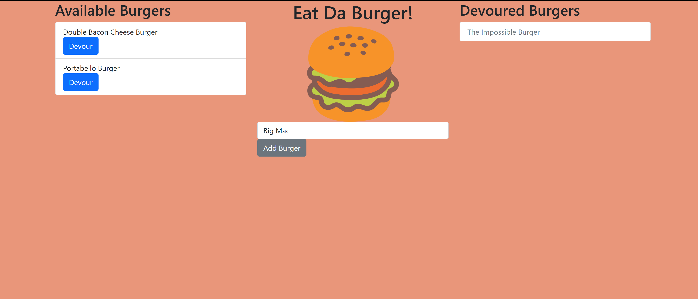

# Eat Da Burger 

## Description
This is a simple full-stack application that uses MySQL, Node, Express, Handlebars and a homemade ORM. It allows users to add a new burger to a database, and to devour the burger, rendering it disabled. Not much to the functionality portion but it's got a lot going on behing the scenes!

## Table of Contents
1. [Description](#description)
2. [Installation](#installation)
3. [Usage](#usage)
4. [License](#license)
5. [Contributing](#contributing)
6. [Tests](#tests)
7. [Questions](#questions)

## Installation
npm install

## Usage
'node server.js' or see it on heroku

## License
The MIT License

## Contributing
James Totah

## Tests
none

## Questions

- Github Profile: [jtwob](https://github.com/jtwob)
- Email: jtotah@usfca.edu
